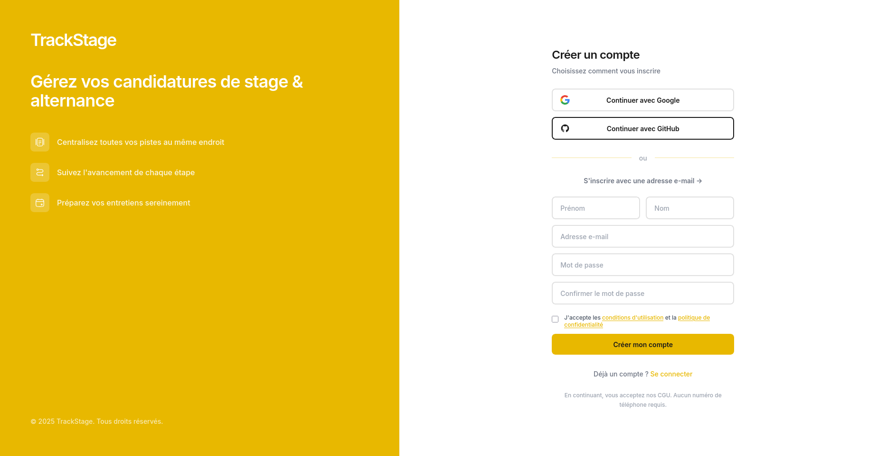
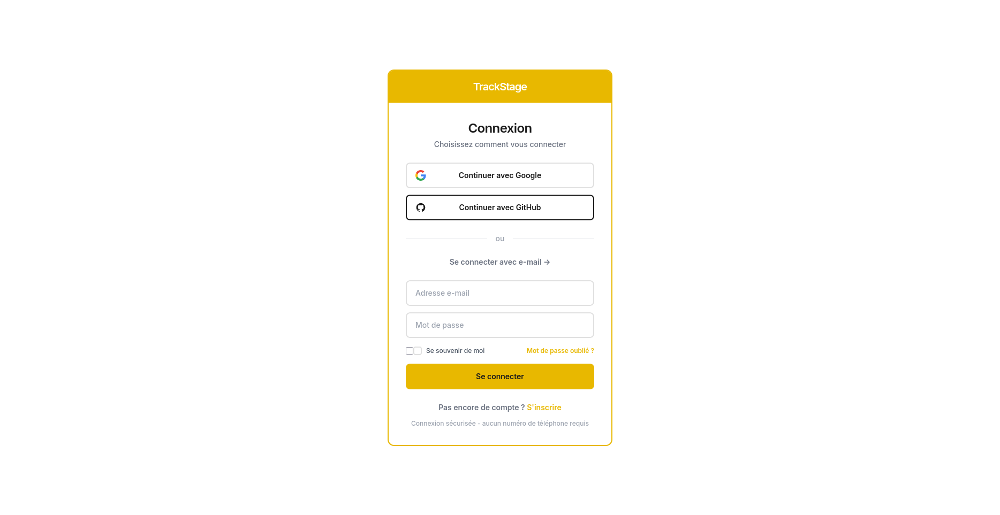
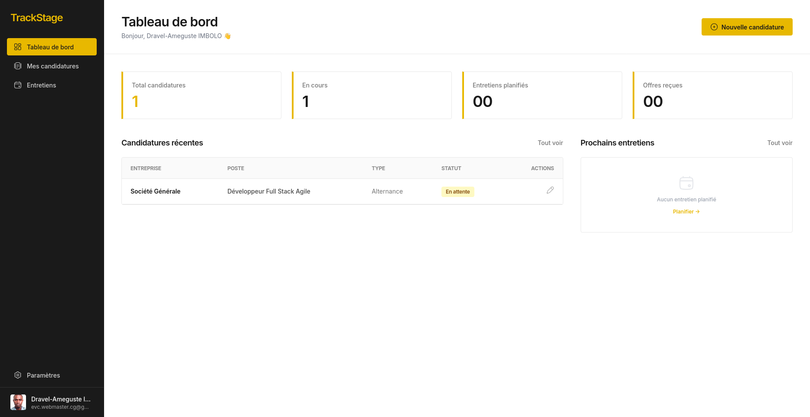
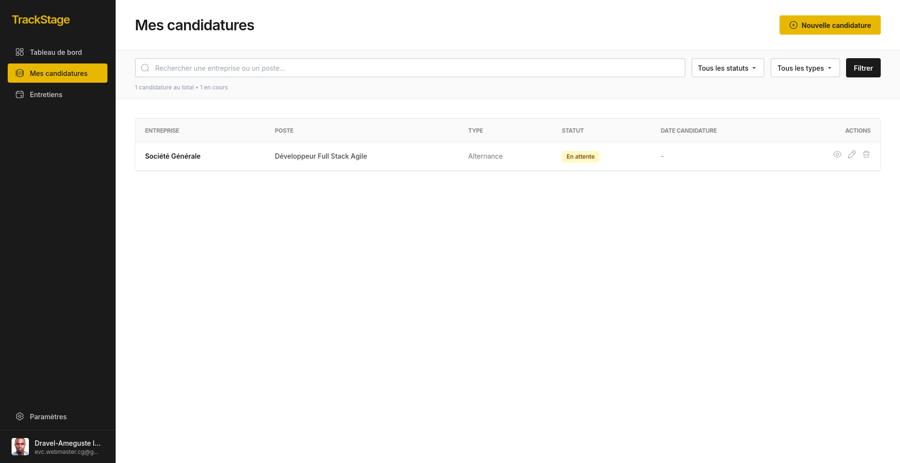
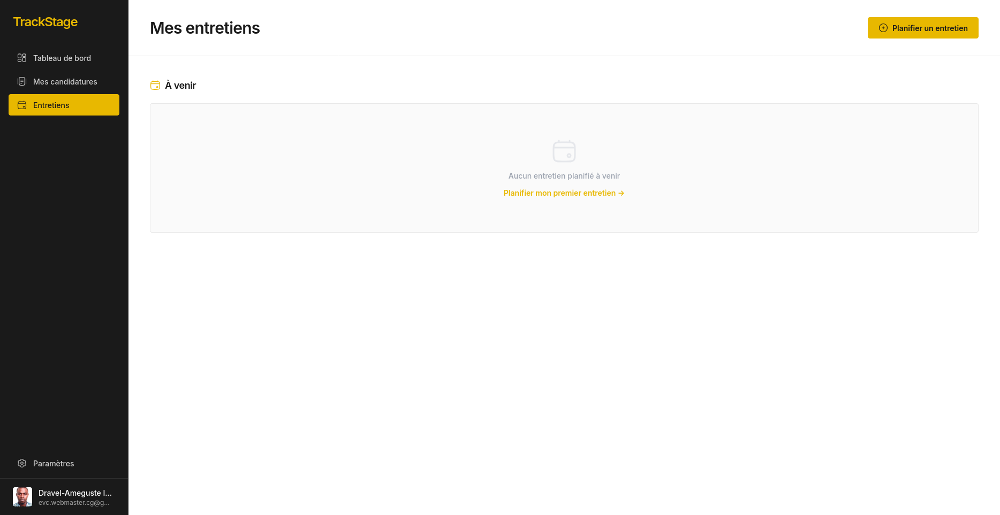
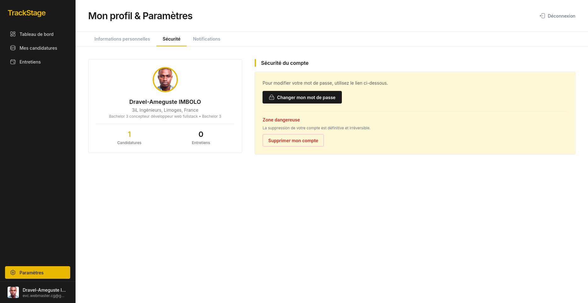

<!-- Titre animé - texte BLANC -->

**`Projet Full Stack · Django · Tailwind CSS · PostgreSQL`**

_Une solution web dédiée à la gestion et au suivi des candidatures._

 

 

---

_Gérez vos candidatures de stage et d’alternance, du premier contact jusqu’à la signature de l’offre._

---

## _Stack technique_

<table align="center">
<tr>
  <td align="center">
    <strong>Backend</strong> 
    
  </td>
  <td align="center">
    <strong>Frontend</strong> 
    
  </td>
  <td align="center">
    <strong>Bases de données</strong> 
    
  </td>
  <td align="center">
    <strong>DevOps & Outils</strong> 
    
  </td>
</tr>
</table>

## _Aperçu_

<table align="center" style="border-spacing:8px;">
<tr>
  <td align="center">
    
     Inscription
  </td>
  <td align="center">
    
     Connexion
  </td>
  <td align="center">
    
     Dashboard
  </td>
</tr>
<tr>
  <td align="center">
    
     Candidatures
  </td>
  <td align="center">
    
     Entretiens
  </td>
  <td align="center">
    
     Profil
  </td>
</tr>
</table>

## _Architecture_

<table style="border-spacing:0; font-size:13px; width:100%;">
<tr>
  <th align="left" style="padding:8px 12px; width:20%;">Dossier</th>
  <th align="left" style="padding:8px 12px;">Fichiers</th>
</tr>
<tr>
  <td style="padding:8px 12px;"><code>config/</code></td>
  <td style="padding:8px 12px;"><code>settings/base.py</code> · <code>settings/development.py</code> · <code>settings/production.py</code> · <code>urls.py</code></td>
</tr>
<tr>
  <td style="padding:8px 12px;"><code>accounts/</code></td>
  <td style="padding:8px 12px;"><code>models.py</code> · <code>views.py</code> · <code>forms.py</code> · <code>tests.py</code></td>
</tr>
<tr>
  <td style="padding:8px 12px;"><code>candidatures/</code></td>
  <td style="padding:8px 12px;"><code>models.py</code> · <code>views.py</code> · <code>forms.py</code> · <code>tests.py</code></td>
</tr>
<tr>
  <td style="padding:8px 12px;"><code>entretiens/</code></td>
  <td style="padding:8px 12px;"><code>models.py</code> · <code>views.py</code> · <code>forms.py</code> · <code>tests.py</code></td>
</tr>
<tr>
  <td style="padding:8px 12px;"><code>dashboard/</code></td>
  <td style="padding:8px 12px;"><code>views.py</code> · <code>urls.py</code></td>
</tr>
<tr>
  <td style="padding:8px 12px;"><code>templates/</code></td>
  <td style="padding:8px 12px;"><code>base.html</code> · <code>auth_base.html</code> · <code>accounts/</code> · <code>candidatures/</code> · <code>entretiens/</code> · <code>dashboard/</code></td>
</tr>
<tr>
  <td style="padding:8px 12px;"><code>racine/</code></td>
  <td style="padding:8px 12px;"><code>manage.py</code> · <code>requirements.txt</code> · <code>requirements-dev.txt</code> · <code>pytest.ini</code> · <code>pyproject.toml</code> · <code>.env.example</code> · <code>.gitignore</code></td>
</tr>
</table>

## _Installation_

<table align="center" style="border-spacing:0; font-size:13px; width:100%;">
<tr>
  <th align="left" style="padding:8px 12px;">Étape</th>
  <th align="left" style="padding:8px 12px;">Commande</th>
  <th align="left" style="padding:8px 12px;">Description</th>
</tr>
<tr>
  <td align="center" style="padding:8px 12px;"><code>1</code></td>
  <td style="padding:8px 12px;"><code>git clone https://github.com/dravelimbolo/track-stage-alternance-django.git && cd track-stage-alternance-django</code></td>
  <td style="padding:8px 12px;">Cloner le dépôt et se placer dedans</td>
</tr>
<tr>
  <td align="center" style="padding:8px 12px;"><code>2</code></td>
  <td style="padding:8px 12px;"><code>python -m venv .venv && source .venv/bin/activate</code></td>
  <td style="padding:8px 12px;">Créer et activer l'environnement virtuel <em>(Linux / macOS)</em> <code>.venv\Scripts\activate</code> sous Windows</td>
</tr>
<tr>
  <td align="center" style="padding:8px 12px;"><code>3</code></td>
  <td style="padding:8px 12px;"><code>pip install -r requirements-dev.txt</code></td>
  <td style="padding:8px 12px;">Installer les dépendances de développement</td>
</tr>
<tr>
  <td align="center" style="padding:8px 12px;"><code>4</code></td>
  <td style="padding:8px 12px;"><code>cp .env.example .env</code></td>
  <td style="padding:8px 12px;">Copier le template et renseigner les variables d'environnement</td>
</tr>
<tr>
  <td align="center" style="padding:8px 12px;"><code>5</code></td>
  <td style="padding:8px 12px;"><code>python manage.py migrate</code></td>
  <td style="padding:8px 12px;">Appliquer les migrations</td>
</tr>
<tr>
  <td align="center" style="padding:8px 12px;"><code>6</code></td>
  <td style="padding:8px 12px;"><code>python manage.py createsuperuser</code></td>
  <td style="padding:8px 12px;">Créer un superutilisateur <em>(accès /admin)</em></td>
</tr>
<tr>
  <td align="center" style="padding:8px 12px;"><code>7</code></td>
  <td style="padding:8px 12px;"><code>python manage.py runserver</code></td>
  <td style="padding:8px 12px;">Lancer le serveur <code>http://127.0.0.1:8000</code></td>
</tr>
<tr>
  <td align="center" style="padding:8px 12px;"><code>8</code></td>
  <td style="padding:8px 12px;"><code>pytest</code></td>
  <td style="padding:8px 12px;">Lancer tous les tests</td>
</tr>
<tr>
  <td align="center" style="padding:8px 12px;"><code>9</code></td>
  <td style="padding:8px 12px;"><code>pytest apps/candidatures/tests.py -v</code></td>
  <td style="padding:8px 12px;">Tests d'une app spécifique</td>
</tr>
<tr>
  <td align="center" style="padding:8px 12px;"><code>10</code></td>
  <td style="padding:8px 12px;"><code>coverage run -m pytest && coverage report</code></td>
  <td style="padding:8px 12px;">Exécuter les tests avec rapport de couverture</td>
</tr>
<tr>
  <td align="center" style="padding:8px 12px;"><code>11</code></td>
  <td style="padding:8px 12px;"><code>ruff check . && black .</code></td>
  <td style="padding:8px 12px;">Lint + formatage automatique</td>
</tr>
</table>

---

 

_"Transformons des idées en applications fonctionnelles, robustes et scalables."_

 

